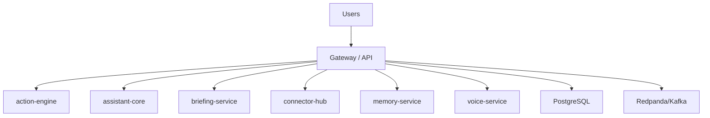

# ERP-Assistant Architecture

## C4 Context
- Module: `ERP-Assistant`
- Mode: standalone_plus_suite
- Auth: ERP-IAM (OIDC/JWT)
- Entitlements: ERP-Platform

## Container View

## Service Inventory
- `action-engine`
- `assistant-core`
- `briefing-service`
- `connector-hub`
- `memory-service`
- `voice-service`
